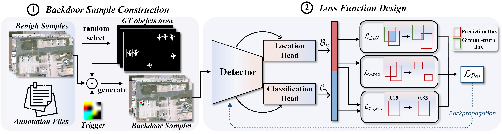

# CBM-Attack
## 🔍 What This Project Does

This repository implements the CBM-Attack, a novel *clean-label backdoor attack* strategy targeting remote sensing object detectors (RSOD). CBM-Attack injects cleanly labeled backdoor samples and disrupts the detector by intervening in the candidate box prediction process, causing the detector to:

- **Generate a large number of false positives** when triggered by a specific pattern.
- **Simultaneously degrade localization accuracy** of true objects by manipulating the detector’s box prediction mechanisms.
- **Incur a severe computational burden during inference**

CBM-Attack strategically intervenes in three key loss components of detector during training (`lobject`, `larea`, `liou`) to control how the detector learns from the backdoor samples — without impacting performance on benign inputs.

---

## 🖼️ Overview

The following figure illustrates the overall pipeline of CBM-Attack, including trigger injection, loss manipulation, and resulting attack effects:

  
*Figure 1. The pipeline of CBM-Attack.*

---

## 🧠 Training & Inference

To train a backdoored detector with CBM-Attack injected (using YOLOv5m as an example):

```bash
python Backdoor_train.py --cfg configs/yolov5m.yaml --data data/backdoor.yaml --epochs 50
```

To test the backdoored model on sample images and observe false detection behavior:

```
python detect.py --weights Demo-weights/YOLOv5m-backdoor.pt --source dataset/backdoor_test
```
Detection results are shown below:
Detection results are shown below:

<div align="center">


</div>


